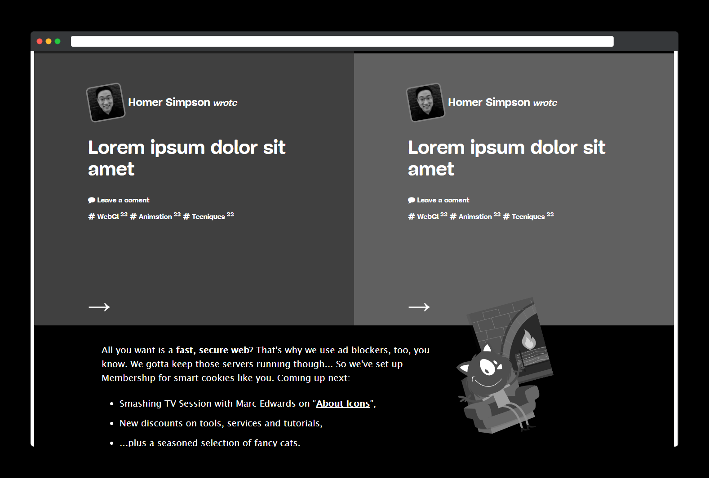

# HTML and CSS PROJECT: DESIGN TEARDOWN

> The goal for this exercise is to start to think in terms of visual hierarchy, typography and design principles.

I created this project using some images and buttons tags, also we used flex boxes, floats and gird systems for positioning.

## Built With

- HTML.
- CSS.
- VS Code.
- Git/GitHub.

## Live Demo

[Live Demo Link](https://rawcdn.githack.com/carloso0114/Project-Design-Teardown/a3dd326cb3a84c0fadecc2bd31bdc1ee9ef1e0e8/index.html)

## How to run it

To get a local copy up and running follow these simple steps.

* If you're using latest version of git.

* Clone this url https://github.com/carloso0114/Project-Design-Teardown on your local host.

* You have to use a Web explorer browser like Google Chrome or Mozilla Firefox to open the index.html file.

## Authors

👤 **carloso0114**

- GitHub: [@carloso0114](https://github.com/AlejandroNo4)
- Twitter: [@Carlos_Osp1](https://twitter.com/Carlos_Osp1)
- LinkedIn: [Carlos Ospina](https://www.linkedin.com/in/carlos-ospina-242b831a6/)

## Show your support

Give a ⭐️ if you like this project!
